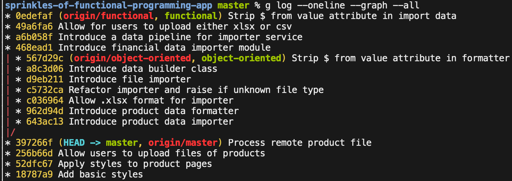

# Sprinkles of Functional Programming

Example application for the Rails Conf 2019 Talk: Sprinkles of Functional
Programming.

Slides for the presentation can be found here:

[slideshare](https://speakerdeck.com/johnschoeman/sprinkles-of-functional-programming)

[slides-repo](https://github.com/johnschoeman/sprinkles-of-functional-programming/blob/master/deck.md)

---

This repo has three branches: master, object-oriented, functional.

The end of the master branch is the starting point, the object-oriented and
functional branches are the implementation of the same set of functionality done
in an objected-oriented approach and a functional approach respectively.

Feature Set:

0. Users can upload csvs of products
1. Users can upload either csv or xlsx files
2. Users can upload files where the value column has a leading '$'

### Branches

I would recommend walk through each commit of each branch to compare and
contrast the differences in the styles.
